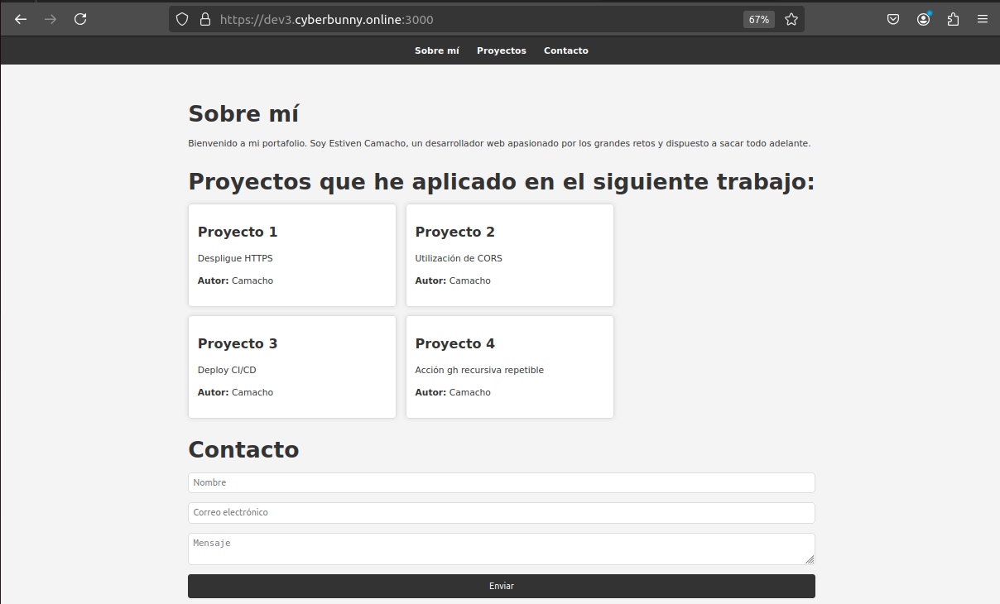
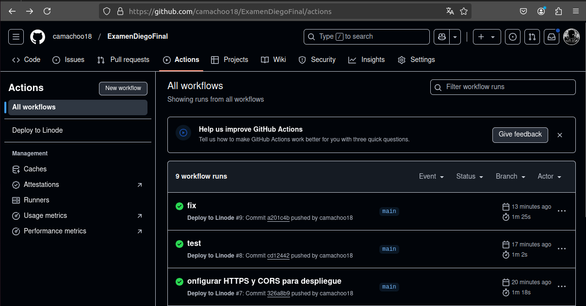

# Informe del Examen

## Introducción

Este documento describe los pasos que he seguido para completar el examen, las herramientas que he utilizado y las pruebas que demuestran que cada uno de los objetivos se ha cumplido.

## Pasos Seguidos

### Paso 1: Configuración del Entorno

1. **Acceso al VPS:**
   ```sh
   ssh root@MI-IP ```
Una vez dentro aplicamos:
Actualización de paquetes con sudo apt update
Clonamos el repo
Instalo las dependencias
sudo apt install npm
npm install -g pm2
cd NOMBRE-REPO
npm install

Paso 2: Ejecución del Script de Despliegue
Ejecución del script deploy.sh:

Este script realiza las siguientes acciones:

Actualiza los paquetes del sistema.
Instala npm, nodejs y certbot.
Genera certificados SSL usando certbot.
Copia los certificados generados a la ubicación esperada por la aplicación.
Paso 3: Inicio del Servidor
Inicio del servidor con HTTPS configurado:

Verificación del estado del servidor:

Paso 4: Configuración de GitHub Actions
Configuración de secretos en GitHub:

SSH_HOST: La dirección IP o el nombre de host de mi servidor.
SSH_USER: El nombre de usuario para conectarse a tu servidor.
SSH_PASSWORD: La contraseña para el usuario SSH.
Actualización del archivo deploy.yml: El archivo deploy.yml está configurado para realizar el despliegue automáticamente cuando se hace un push a la rama main.

Paso 5: Pruebas
Verificación de HTTPS: Accedí a https://dev3.cyberbunny.online y verifiqué que el sitio web se carga correctamente con HTTPS.

Pruebas de CORS: Realicé solicitudes desde un origen diferente y verifiqué que las respuestas se recibían correctamente, confirmando que CORS está configurado adecuadamente.

Pruebas de API: Utilicé herramientas como Postman para probar las rutas /posts y /posts (GET y POST) y verifiqué que las entradas del blog se obtienen y se agregan correctamente.

Herramientas Utilizadas
VPS: Para alojar la aplicación.
GitHub Actions: Para automatizar el despliegue.
Certbot: Para generar certificados SSL.
PM2: Para gestionar el proceso del servidor.
Postman: Para probar las API.
Conclusión
He seguido todos los pasos necesarios para configurar y desplegar la aplicación con HTTPS y CORS. Las pruebas realizadas demuestran que cada uno de los objetivos se ha cumplido correctamente.


